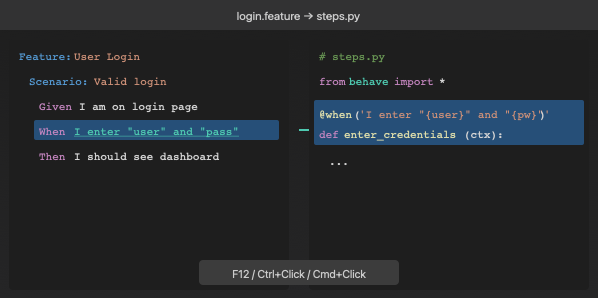
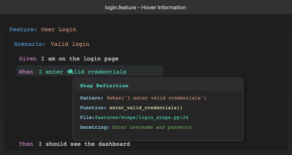

# Gherkin Step Navigator

A VS Code extension that provides seamless navigation from Gherkin feature file steps to Python Behave step definitions.

## Features

### 🔗 Go to Definition (F12 / Ctrl+Click / Cmd+Click)
Click on any step in a `.feature` file and navigate directly to the corresponding Python step definition.



### 📋 Hover Information
Hover over a step to see details about the matching step definition, including:
- The step decorator pattern
- The function name
- The file location
- The docstring (if available)



### 🔍 CodeLens
Each step shows a CodeLens annotation above it indicating where the step definition is located. Click to navigate directly.

> **Tip:** If you find the CodeLens annotations cluttering your `.feature` files, you can disable them by setting `gherkinStepNavigator.enableCodeLens` to `false` in your VS Code settings. The change takes effect immediately without requiring a reload.

### 🔄 Auto-refresh
The extension automatically updates its cache when step definition files are modified.

## Installation

### From VSIX (Recommended for local development)

1. Clone this repository:
   ```bash
   git clone ****gherkin-step-navigator.git
   cd gherkin-step-navigator
   ```

2. Install dependencies:
   ```bash
   npm install
   ```

3. Build the extension:
   ```bash
   npm run compile
   ```

4. Package the extension:
   ```bash
   npm run package
   ```

5. Install the generated `.vsix` file:
   - Open VS Code
   - Press `Ctrl+Shift+P` (or `Cmd+Shift+P` on macOS)
   - Type "Install from VSIX"
   - Select the generated `gherkin-step-navigator-x.x.x.vsix` file

### From VS Code Marketplace
*(Coming soon)*

## Configuration

Configure the extension in your VS Code settings:

```json
{
    // Glob patterns to find Python step definition files
    "gherkinStepNavigator.stepDefinitionPaths": [
        "**/steps/**/*.py",
        "**/step_definitions/**/*.py",
        "**/features/steps/**/*.py"
    ],
    
    // Python decorators to recognize as step definitions
    "gherkinStepNavigator.stepDecorators": [
        "@step",
        "@given",
        "@when",
        "@then",
        "@and",
        "@but"
    ],
    
    // Enable hover information for steps
    "gherkinStepNavigator.enableHover": true,
    
    // Enable CodeLens showing step definition file (can be toggled without reload)
    "gherkinStepNavigator.enableCodeLens": true
}
```

## Supported Step Definition Patterns

The extension supports various Behave step definition patterns:

### Basic patterns
```python
@step('I click the button')
def click_button(context):
    pass
```

### String parameters
```python
@step('the user "{username}" logs in')
def user_login(context, username):
    pass
```

### Typed parameters
```python
@step('I wait for {seconds:d} seconds')
def wait_seconds(context, seconds):
    pass
```

### Multiple decorators
```python
@given('I am on the home page')
@when('I navigate to the home page')
def go_to_home(context):
    pass
```

## Commands

| Command | Description | Shortcut |
|---------|-------------|----------|
| Go to Step Definition | Navigate to the step definition | `F12` / `Ctrl+Click` |
| Refresh Step Cache | Rebuild the step definition cache | - |
| Find All Step Usages | Find all feature files using a step definition | - |

## Requirements

- VS Code 1.85.0 or higher
- Python Behave framework step definitions
- Gherkin feature files (`.feature`)

## Known Issues

- The extension currently supports Python step definitions only
- Complex regex patterns in step definitions may not be fully supported

## Contributing

Contributions are welcome! Please feel free to submit a Pull Request.

1. Fork the repository
2. Create your feature branch (`git checkout -b feature/amazing-feature`)
3. Commit your changes (`git commit -m 'Add some amazing feature'`)
4. Push to the branch (`git push origin feature/amazing-feature`)
5. Open a Pull Request

## Development

### Setup
```bash
npm install
```

### Build
```bash
npm run compile
```

### Watch mode
```bash
npm run watch
```

### Debug
Press `F5` in VS Code to launch the Extension Development Host.

### Run tests
```bash
npm test
```

### Package
```bash
npm run package
```

## License

MIT License - see [LICENSE](LICENSE) for details.

## Author

Sheikh Jebran

## Changelog

### 1.0.0
- Initial release
- Go to Definition support
- Hover information
- CodeLens integration
- Automatic cache refresh

---

**Enjoy!** 🚀
